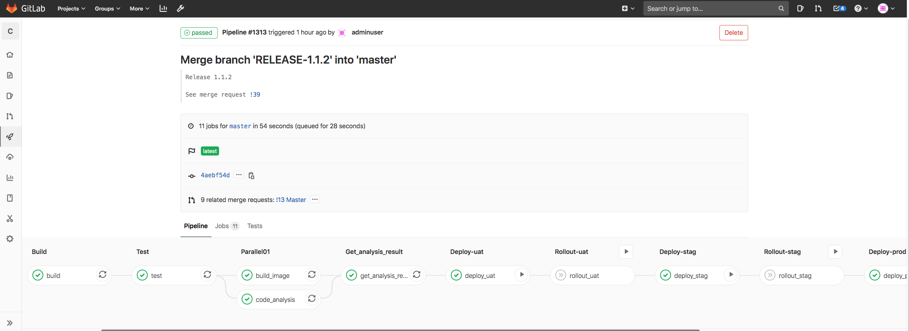
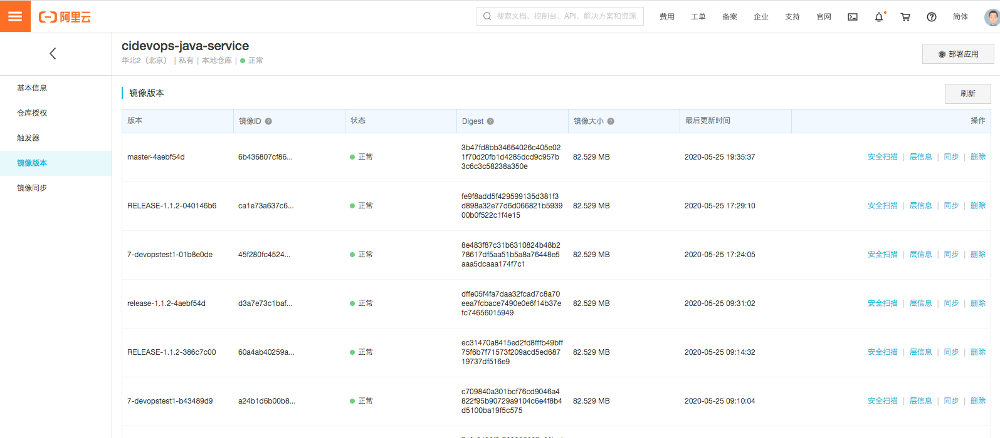
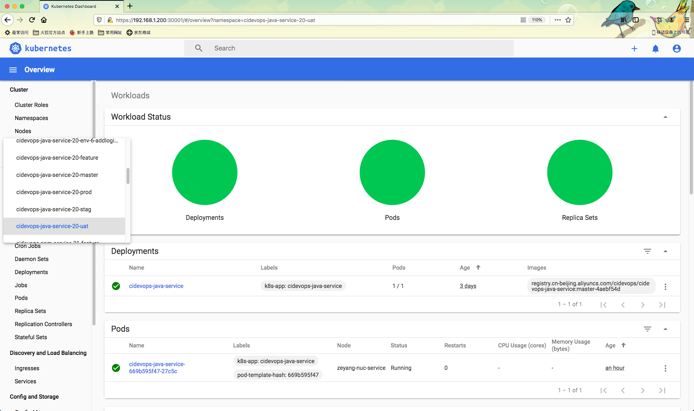

# 后端JAVA项目流水实践

templates/java-pipeline.yml

## 导入作业模板

```text
include:
  - project: 'cidevops/cidevops-newci-service'
    ref: master
    file: 'templates/default-pipeline.yml'
```

## 配置项目参数

```text
variables:
  ## 全局配置
  GIT_CLONE_PATH: ${CI_BUILDS_DIR}/builds/${CI_PROJECT_NAMESPACE}/${CI_PROJECT_NAME}/${CI_PIPELINE_ID}    
  GIT_CHECKOUT: "false"
  CACHE_DIR: "target/"

  ## 作业控制
  RUN_PIPELINE_BUILD:   "yes"     #是否运行构建 yes/no 
  RUN_PIPELINE_TEST:    "yes"      #是否运行测试 yes/no 
  RUN_CODE_ANALYSIS:    "yes"     #是否代码扫描 yes/no 
  RUN_BUILD_IMAGE:      "yes"     #是否生成镜像 yes/no
  RUN_DEPLOY_ARTIFACTS: "no"      #是否上传制品 yes/no
  RUN_DEPLOY_K8S:       "yes"     #是否发布K8S yes/no

  ## 依赖容器镜像
  BUILD_IMAGE: "maven:3.6.3-jdk-8"
  CURL_IMAGE: "curlimages/curl:7.70.0"
  SONAR_IMAGE: "sonarsource/sonar-scanner-cli:latest"
  KUBECTL_IMAGE: "lucj/kubectl:1.17.2"


  ## 构建测试参数
  MAVEN_OPTS: "-Dmaven.repo.local=/home/gitlab-runner/ci-build-cache/maven "  #maven构建参数
  BUILD_SHELL: 'mvn clean package  -DskipTests  --settings=./settings.xml '   #构建命令
  #GRADLE_OPTS: ""               #gradle构建参数

  ## 单元测试参数
  TEST_SHELL : 'mvn test  --settings=./settings.xml   '       #测试命令
  JUNIT_REPORT_PATH: 'target/surefire-reports/TEST-*.xml'   #单元测试报告

  ## 代码扫描
  SONAR_SOURCE_DIR : "src"                                          #项目源码目录
  SONAR_SERVER_URL: "http://192.168.1.200:30090"                    #SonarQube服务器信息
  SONAR_SERVER_LOGIN: "ee2bcb37deeb6dfe3a07fe08fb529559b00c1b7b"    #Sonar Token最好在项目中定义。
  SONAR_SCAN_ARGS: "-Dsonar.sources=${SONAR_SOURCE_DIR} 
                   -Dsonar.java.binaries=target/classes 
                   -Dsonar.java.test.binaries=target/test-classes 
                   -Dsonar.java.surefire.report=target/surefire-reports "                                     #项目扫描参数

  ## 构建镜像
  CI_REGISTRY: 'registry.cn-beijing.aliyuncs.com'               #镜像仓库地址              
  CI_REGISTRY_USER: 'xxxxxx'                               #仓库用户信息
  #CI_REGISTRY_PASSWD: 'xxxxxxxx.'                              #仓库用户密码
  IMAGE_NAME: "${CI_REGISTRY}/${CI_PROJECT_PATH}:${CI_COMMIT_REF_NAME}-${CI_COMMIT_SHORT_SHA}"     #镜像名称
  DOCKER_FILE_PATH: "./Dockerfile"                              #Dockerfile位置

  ## 上传制品库(artifactory)
  #ARTIFACTORY_URL: "http://192.168.1.200:30082/artifactory"     #制品库地址
  #ARTIFACTORY_NAME: "${CI_PROJECT_NAMESPACE}"                   #制品库名称
  #ARTIFACT_PACKAGE: "jar"                                       #制品类型
  #ARTIFACT_PATH: "target/*.${ARTIFACT_PACKAGE}"                 #制品位置
  #TARGET_FILE_PATH: "${CI_PROJECT_NAMESPACE}/${CI_PROJECT_NAME}/${CI_COMMIT_REF_NAME}-${CI_COMMIT_SHORT_SHA}"   #目标制品位置(目录结构)
  #TARGET_ARTIFACT_NAME: "${CI_PROJECT_NAME}-${CI_COMMIT_REF_NAME}-${CI_COMMIT_SHORT_SHA}.${ARTIFACT_PACKAGE}"   #目标制品名称

  ## 部署应用k8s
  APP_NAME: "$CI_PROJECT_NAME"                #应用名称 <-->deploymentName
  CONTAINER_PORT: "8081"                      #服务端口 <--> servicesPort
  NAMESPACE: "$CI_PROJECT_NAME-$CI_PROJECT_ID-$CI_ENVIRONMENT_SLUG"             #名称空间
  ENV_URL: "${ENV_NAME}.${CI_PROJECT_NAMESPACE}.${CI_PROJECT_NAME}.devops.com"  #IngressHosts
```

## 项目指定ci文件


## 运行流水线测试



docker镜像仓库



部署环境演示


Kubernetes集群中应用状态



