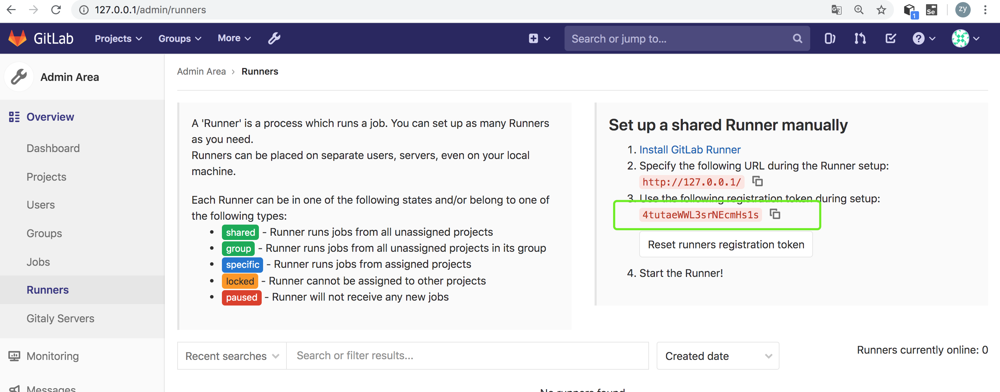
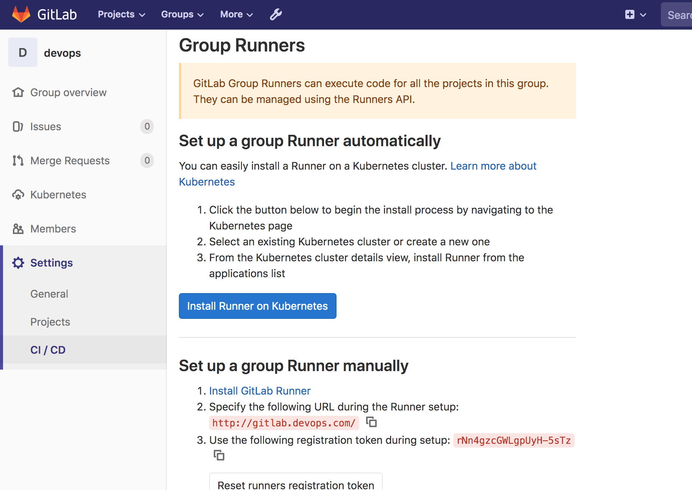
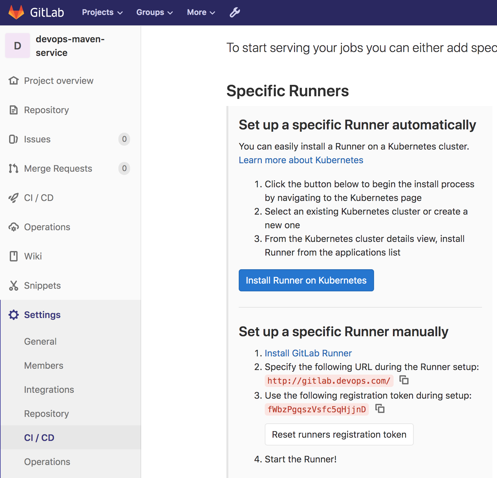
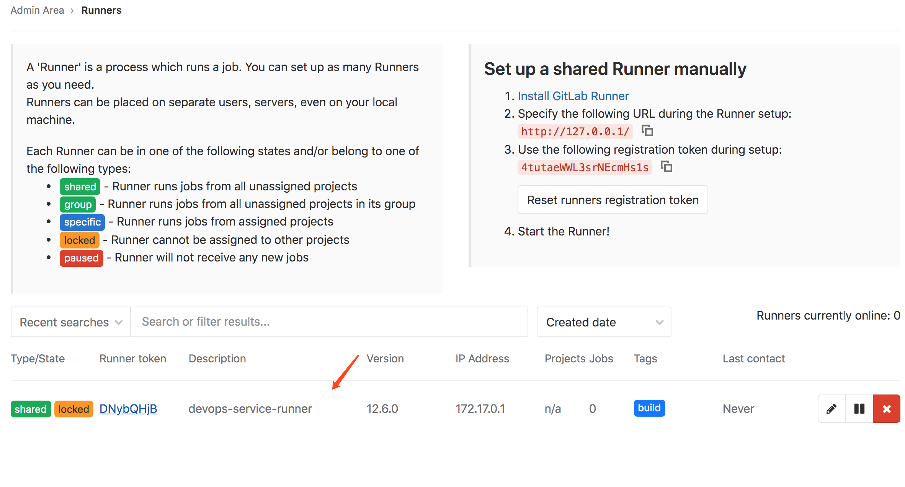

# GitLab Runner 注册

参考链接：https://help.aliyun.com/document_detail/106968.html#title-xfl-dp6-kta

大概过程： 获取runner token -> 进行注册

## GitLabRunner 类型

- shared ： 运行整个平台项目的作业（gitlab）
- group： 运行特定group下的所有项目的作业（group）
- specific: 运行指定的项目作业（project）
- locked： 无法运行项目作业 
- paused： 不会运行作业

## 获取runner token

- 获取`shared`类型runnertoken**

进入系统设置 -> Runners



- 获取`group`类型的runnertoken**

进入group -> Settings -> CI/CD -> Runners -> Group Runners



- 获取`specific`类型的runnertoken**

进入具体的项目 -> Settings -> CI/CD -> Runners -> Specific Runners



## 进行注册

### Docker

方式1： 启动容器交互式注册

```shell
docker run --rm -t -i -v ~/data/gitlab-runner/config:/etc/gitlab-runner gitlab/gitlab-runner:v12.6.0 register
```

```
Runtime platform                                    arch=amd64 os=linux pid=6 revision=ac8e767a version=12.6.0
Running in system-mode.

Please enter the gitlab-ci coordinator URL (e.g. https://gitlab.com/):
http://192.168.1.105
Please enter the gitlab-ci token for this runner:
4tutaeWWL3srNEcmHs1s
Please enter the gitlab-ci description for this runner:
[00e4f023b5ae]: devops-service-runner
Please enter the gitlab-ci tags for this runner (comma separated):
build
Registering runner... succeeded                     runner=4tutaeWW
Please enter the executor: parallels, virtualbox, docker-ssh+machine, kubernetes, docker+machine, custom, docker, docker-ssh, shell, ssh:
shell
Runner registered successfully. Feel free to start it, but if it's running already the config should be automatically reloaded!
```

方式2：直接注册

```
docker run --rm -v ~/data/gitlab-runner/config:/etc/gitlab-runner gitlab/gitlab-runner:v12.6.0 register \
  --non-interactive \
  --executor "docker" \
  --docker-image alpine:latest \
  --url "http://192.168.1.200:30088/" \
  --registration-token "JRzzw2j1Ji6aBjwvkxAv" \
  --description "docker-runner" \
  --tag-list "docker,aws" \
  --run-untagged="true" \
  --locked="false" \
  --access-level="not_protected"
```

```
docker run -it --rm -v ~/data/gitlab-runner/config:/etc/gitlab-runner gitlab/gitlab-runner:v12.6.0 register \
  --non-interactive \
  --executor "shell" \
  --url "http://gitlab.devops.com" \
  --registration-token "FZwnmCacrXfk37yZzfNJ" \
  --description "devops-runner" \
  --tag-list "build,deploy" \
  --run-untagged="true" \
  --locked="false" \
  --access-level="not_protected"
```

```
docker run -itd --rm -v ~/data/gitlab-runner/config:/etc/gitlab-runner  gitlab/gitlab-runner:v12.6.0 register \
  --non-interactive \
  --executor "shell" \
  --url "http://192.168.1.200:30088/" \
  --registration-token "JRzzw2j1Ji6aBjwvkxAv" \
  --description "devops-runner" \
  --tag-list "build,deploy" \
  --run-untagged="true" \
  --locked="false" \
  --access-level="not_protected"
```

效果



## 其他变量

关于注册的选项

```
   -c value, --config value                                     指定配置文件
   --template-config value                                      指定模板配置文件
   --tag-list value                                             指定runner的标签列表，逗号分隔
   -n, --non-interactive                                        无交互进行runner注册 
   --leave-runner                                               如果注册失败，不用删除runner 
   -r value, --registration-token value                         runner的注册token
   --run-untagged                              注册运行未加标签的构建，默认当标签列表为空时值为true
   --locked                                                     锁定runner 默认true
   --access-level value        设置访问等级 not_protected or ref_protected; 默认 not_protected 
   --maximum-timeout value                             为作业设置最大运行超时时间 默认零 单位秒
   --paused                                            设置runner为 paused,默认 'false' 
   --name value, --description value                            Runner 名称 
   --limit value                                       程序处理的最大构建数量default: "0"
   --output-limit value                                最大的构建大小单位kb default: "0"
   --request-concurrency value                         作业请求的最大并发数 default: "0"
   -u value, --url value                                        GitlabCI服务器地址
   -t value, --token value                                      GitlabCI服务器token
```

```
root@82948f0a37e3:/# gitlab-runner register --help
Runtime platform                                    arch=amd64 os=linux pid=168 revision=ac8e767a version=12.6.0
NAME:
   gitlab-runner register - register a new runner

USAGE:
   gitlab-runner register [command options] [arguments...]

OPTIONS:
   
   
   
   --tls-ca-file value                                          File containing the certificates to verify the peer when using HTTPS [$CI_SERVER_TLS_CA_FILE]
   --tls-cert-file value                                        File containing certificate for TLS client auth when using HTTPS [$CI_SERVER_TLS_CERT_FILE]
   --tls-key-file value                                         File containing private key for TLS client auth when using HTTPS [$CI_SERVER_TLS_KEY_FILE]
   
   
   --executor value                                             选择执行器，例如shell，docker 
   --builds-dir value                                           设置构建存储目录
   --cache-dir value                                            设置构建缓存目录
   --clone-url value                                            覆盖默认通过git克隆的URL
   --env value                                                  注入自定义环境变量以构建环境
   --pre-clone-script value                           在提取代码之前执行的特定于运行程序的命令脚本
   --pre-build-script value              特定于运行程序的命令脚本，在提取代码之后，在构建执行之前执行
   --post-build-script value            特定于运行程序的命令脚本，在提取代码后以及在构建执行后立即执行
   --debug-trace-disabled               设置为true时，Runner将禁用使用CI_DEBUG_TRACE功能的可能性                        
   --shell value                        选择 bash, cmd or powershell [$RUNNER_SHELL]
   --custom_build_dir-enabled           启用作业特定的构建目录[$CUSTOM_BUILD_DIR_ENABLED]
   --ssh-user value                                             ssh用户名称 [$SSH_USER]
   --ssh-password value                                         ssh用户密码[$SSH_PASSWORD]
   --ssh-host value                                             ssh远程主机[$SSH_HOST]
   --ssh-port value                                             ssh远程主机端口 [$SSH_PORT]
   --ssh-identity-file value                               ssh认证文件 [$SSH_IDENTITY_FILE]
   
   
   --docker-host value                                          Docker主机地址 [$DOCKER_HOST]
   --docker-cert-path value                                Docker证书路径 [$DOCKER_CERT_PATH]
   --docker-tlsverify                             Docker使用TLS并验证远程 [$DOCKER_TLS_VERIFY]
   --docker-hostname value                                自定义容器主机名称 [$DOCKER_HOSTNAME]
   --docker-image value                                         定义Docker镜像[$DOCKER_IMAGE]
   --docker-runtime value                        Docker runtime to be used [$DOCKER_RUNTIME]
   --docker-memory value                   内存限制 Unit [b, k, m, or g]  4M [$DOCKER_MEMORY]
   --docker-memory-swap value 内存限制memory + swap，Unit[b, k, m, or g][$DOCKER_MEMORY_SWAP]
   --docker-memory-reservation value                   内存软限制[$DOCKER_MEMORY_RESERVATION]
   --docker-cpuset-cpus value                                   cpu限制[$DOCKER_CPUSET_CPUS]
   --docker-cpus value                                         cpu数量 [$DOCKER_CPUS]
   --docker-cpu-shares value                 CPU shares (default: "0") [$DOCKER_CPU_SHARES]
   --docker-dns value                                           A list of DNS servers for the container to use [$DOCKER_DNS]
   --docker-dns-search value                                    A list of DNS search domains [$DOCKER_DNS_SEARCH]
   --docker-privileged                                          Give extended privileges to container [$DOCKER_PRIVILEGED]
   --docker-disable-entrypoint-overwrite                        Disable the possibility for a container to overwrite the default image entrypoint [$DOCKER_DISABLE_ENTRYPOINT_OVERWRITE]
   --docker-userns value                                        User namespace to use [$DOCKER_USERNS_MODE]
   --docker-cap-add value                                       Add Linux capabilities [$DOCKER_CAP_ADD]
   --docker-cap-drop value                                      Drop Linux capabilities [$DOCKER_CAP_DROP]
   --docker-oom-kill-disable                                    Do not kill processes in a container if an out-of-memory (OOM) error occurs [$DOCKER_OOM_KILL_DISABLE]
   --docker-oom-score-adjust value                              Adjust OOM score (default: "0") [$DOCKER_OOM_SCORE_ADJUST]
   --docker-security-opt value                                  Security Options [$DOCKER_SECURITY_OPT]
   --docker-devices value                                       Add a host device to the container [$DOCKER_DEVICES]
   --docker-disable-cache                                       Disable all container caching [$DOCKER_DISABLE_CACHE]
   --docker-volumes value                                       Bind-mount a volume and create it if it doesn't exist prior to mounting. Can be specified multiple times once per mountpoint, e.g. --docker-volumes 'test0:/test0' --docker-volumes 'test1:/test1' [$DOCKER_VOLUMES]
   --docker-volume-driver value                                 Volume driver to be used [$DOCKER_VOLUME_DRIVER]
   --docker-cache-dir value                                     Directory where to store caches [$DOCKER_CACHE_DIR]
   --docker-extra-hosts value                                   Add a custom host-to-IP mapping [$DOCKER_EXTRA_HOSTS]
   --docker-volumes-from value                                  A list of volumes to inherit from another container [$DOCKER_VOLUMES_FROM]
   --docker-network-mode value                                  Add container to a custom network [$DOCKER_NETWORK_MODE]
   --docker-links value                                         Add link to another container [$DOCKER_LINKS]
   --docker-services value                                      Add service that is started with container [$DOCKER_SERVICES]
   --docker-wait-for-services-timeout value                     How long to wait for service startup (default: "0") [$DOCKER_WAIT_FOR_SERVICES_TIMEOUT]
   --docker-allowed-images value                                Whitelist allowed images [$DOCKER_ALLOWED_IMAGES]
   --docker-allowed-services value                              Whitelist allowed services [$DOCKER_ALLOWED_SERVICES]
   --docker-pull-policy value                                   Image pull policy: never, if-not-present, always [$DOCKER_PULL_POLICY]
   --docker-shm-size value                                      Shared memory size for docker images (in bytes) (default: "0") [$DOCKER_SHM_SIZE]
   --docker-tmpfs value                                         A toml table/json object with the format key=values. When set this will mount the specified path in the key as a tmpfs volume in the main container, using the options specified as key. For the supported options, see the documentation for the unix 'mount' command (default: "{}") [$DOCKER_TMPFS]
   --docker-services-tmpfs value                                A toml table/json object with the format key=values. When set this will mount the specified path in the key as a tmpfs volume in all the service containers, using the options specified as key. For the supported options, see the documentation for the unix 'mount' command (default: "{}") [$DOCKER_SERVICES_TMPFS]
   --docker-sysctls value                                       Sysctl options, a toml table/json object of key=value. Value is expected to be a string. (default: "{}") [$DOCKER_SYSCTLS]
   --docker-helper-image value                                  [ADVANCED] Override the default helper image used to clone repos and upload artifacts [$DOCKER_HELPER_IMAGE]
   
   
   
   
   
   
   --parallels-base-name value                                  VM name to be used [$PARALLELS_BASE_NAME]
   --parallels-template-name value                              VM template to be created [$PARALLELS_TEMPLATE_NAME]
   --parallels-disable-snapshots                                Disable snapshoting to speedup VM creation [$PARALLELS_DISABLE_SNAPSHOTS]
   --parallels-time-server value                                Timeserver to sync the guests time from. Defaults to time.apple.com [$PARALLELS_TIME_SERVER]
   --virtualbox-base-name value                                 VM name to be used [$VIRTUALBOX_BASE_NAME]
   --virtualbox-base-snapshot value                             Name or UUID of a specific VM snapshot to clone [$VIRTUALBOX_BASE_SNAPSHOT]
   --virtualbox-disable-snapshots                               Disable snapshoting to speedup VM creation [$VIRTUALBOX_DISABLE_SNAPSHOTS]
   --cache-type value                                           Select caching method [$CACHE_TYPE]
   --cache-path value                                           Name of the path to prepend to the cache URL [$CACHE_PATH]
   --cache-shared                                               Enable cache sharing between runners. [$CACHE_SHARED]
   --cache-s3-server-address value                              A host:port to the used S3-compatible server [$CACHE_S3_SERVER_ADDRESS]
   --cache-s3-access-key value                                  S3 Access Key [$CACHE_S3_ACCESS_KEY]
   --cache-s3-secret-key value                                  S3 Secret Key [$CACHE_S3_SECRET_KEY]
   --cache-s3-bucket-name value                                 Name of the bucket where cache will be stored [$CACHE_S3_BUCKET_NAME]
   --cache-s3-bucket-location value                             Name of S3 region [$CACHE_S3_BUCKET_LOCATION]
   --cache-s3-insecure                                          Use insecure mode (without https) [$CACHE_S3_INSECURE]
   --cache-gcs-access-id value                                  ID of GCP Service Account used to access the storage [$CACHE_GCS_ACCESS_ID]
   --cache-gcs-private-key value                                Private key used to sign GCS requests [$CACHE_GCS_PRIVATE_KEY]
   --cache-gcs-credentials-file value                           File with GCP credentials, containing AccessID and PrivateKey [$GOOGLE_APPLICATION_CREDENTIALS]
   --cache-gcs-bucket-name value                                Name of the bucket where cache will be stored [$CACHE_GCS_BUCKET_NAME]
   --machine-idle-nodes value                                   Maximum idle machines (default: "0") [$MACHINE_IDLE_COUNT]
   --machine-idle-time value                                    Minimum time after node can be destroyed (default: "0") [$MACHINE_IDLE_TIME]
   --machine-max-builds value                                   Maximum number of builds processed by machine (default: "0") [$MACHINE_MAX_BUILDS]
   --machine-machine-driver value                               The driver to use when creating machine [$MACHINE_DRIVER]
   --machine-machine-name value                                 The template for machine name (needs to include %s) [$MACHINE_NAME]
   --machine-machine-options value                              Additional machine creation options [$MACHINE_OPTIONS]
   --machine-off-peak-periods value                             Time periods when the scheduler is in the OffPeak mode [$MACHINE_OFF_PEAK_PERIODS]
   --machine-off-peak-timezone value                            Timezone for the OffPeak periods (defaults to Local) [$MACHINE_OFF_PEAK_TIMEZONE]
   --machine-off-peak-idle-count value                          Maximum idle machines when the scheduler is in the OffPeak mode (default: "0") [$MACHINE_OFF_PEAK_IDLE_COUNT]
   --machine-off-peak-idle-time value                           Minimum time after machine can be destroyed when the scheduler is in the OffPeak mode (default: "0") [$MACHINE_OFF_PEAK_IDLE_TIME]
   --kubernetes-host value                                      Optional Kubernetes master host URL (auto-discovery attempted if not specified) [$KUBERNETES_HOST]
   --kubernetes-cert-file value                                 Optional Kubernetes master auth certificate [$KUBERNETES_CERT_FILE]
   --kubernetes-key-file value                                  Optional Kubernetes master auth private key [$KUBERNETES_KEY_FILE]
   --kubernetes-ca-file value                                   Optional Kubernetes master auth ca certificate [$KUBERNETES_CA_FILE]
   --kubernetes-bearer_token_overwrite_allowed                  Bool to authorize builds to specify their own bearer token for creation. [$KUBERNETES_BEARER_TOKEN_OVERWRITE_ALLOWED]
   --kubernetes-bearer_token value                              Optional Kubernetes service account token used to start build pods. [$KUBERNETES_BEARER_TOKEN]
   --kubernetes-image value                                     Default docker image to use for builds when none is specified [$KUBERNETES_IMAGE]
   --kubernetes-namespace value                                 Namespace to run Kubernetes jobs in [$KUBERNETES_NAMESPACE]
   --kubernetes-namespace_overwrite_allowed value               Regex to validate 'KUBERNETES_NAMESPACE_OVERWRITE' value [$KUBERNETES_NAMESPACE_OVERWRITE_ALLOWED]
   --kubernetes-privileged                                      Run all containers with the privileged flag enabled [$KUBERNETES_PRIVILEGED]
   --kubernetes-cpu-limit value                                 The CPU allocation given to build containers [$KUBERNETES_CPU_LIMIT]
   --kubernetes-memory-limit value                              The amount of memory allocated to build containers [$KUBERNETES_MEMORY_LIMIT]
   --kubernetes-service-cpu-limit value                         The CPU allocation given to build service containers [$KUBERNETES_SERVICE_CPU_LIMIT]
   --kubernetes-service-memory-limit value                      The amount of memory allocated to build service containers [$KUBERNETES_SERVICE_MEMORY_LIMIT]
   --kubernetes-helper-cpu-limit value                          The CPU allocation given to build helper containers [$KUBERNETES_HELPER_CPU_LIMIT]
   --kubernetes-helper-memory-limit value                       The amount of memory allocated to build helper containers [$KUBERNETES_HELPER_MEMORY_LIMIT]
   --kubernetes-cpu-request value                               The CPU allocation requested for build containers [$KUBERNETES_CPU_REQUEST]
   --kubernetes-memory-request value                            The amount of memory requested from build containers [$KUBERNETES_MEMORY_REQUEST]
   --kubernetes-service-cpu-request value                       The CPU allocation requested for build service containers [$KUBERNETES_SERVICE_CPU_REQUEST]
   --kubernetes-service-memory-request value                    The amount of memory requested for build service containers [$KUBERNETES_SERVICE_MEMORY_REQUEST]
   --kubernetes-helper-cpu-request value                        The CPU allocation requested for build helper containers [$KUBERNETES_HELPER_CPU_REQUEST]
   --kubernetes-helper-memory-request value                     The amount of memory requested for build helper containers [$KUBERNETES_HELPER_MEMORY_REQUEST]
   --kubernetes-pull-policy value                               Policy for if/when to pull a container image (never, if-not-present, always). The cluster default will be used if not set [$KUBERNETES_PULL_POLICY]
   --kubernetes-node-selector value                             A toml table/json object of key=value. Value is expected to be a string. When set this will create pods on k8s nodes that match all the key=value pairs. (default: "{}") [$KUBERNETES_NODE_SELECTOR]
   --kubernetes-node-tolerations value                          A toml table/json object of key=value:effect. Value and effect are expected to be strings. When set, pods will tolerate the given taints. Only one toleration is supported through environment variable configuration. (default: "{}") [$KUBERNETES_NODE_TOLERATIONS]
   --kubernetes-image-pull-secrets value                        A list of image pull secrets that are used for pulling docker image [$KUBERNETES_IMAGE_PULL_SECRETS]
   --kubernetes-helper-image value                              [ADVANCED] Override the default helper image used to clone repos and upload artifacts [$KUBERNETES_HELPER_IMAGE]
   --kubernetes-terminationGracePeriodSeconds value             Duration after the processes running in the pod are sent a termination signal and the time when the processes are forcibly halted with a kill signal. (default: "0") [$KUBERNETES_TERMINATIONGRACEPERIODSECONDS]
   --kubernetes-poll-interval value                             How frequently, in seconds, the runner will poll the Kubernetes pod it has just created to check its status (default: "0") [$KUBERNETES_POLL_INTERVAL]
   --kubernetes-poll-timeout value                              The total amount of time, in seconds, that needs to pass before the runner will timeout attempting to connect to the pod it has just created (useful for queueing more builds that the cluster can handle at a time) (default: "0") [$KUBERNETES_POLL_TIMEOUT]
   --kubernetes-pod-labels value                                A toml table/json object of key-value. Value is expected to be a string. When set, this will create pods with the given pod labels. Environment variables will be substituted for values here. (default: "{}")
   --kubernetes-service-account value                           Executor pods will use this Service Account to talk to kubernetes API [$KUBERNETES_SERVICE_ACCOUNT]
   --kubernetes-service_account_overwrite_allowed value         Regex to validate 'KUBERNETES_SERVICE_ACCOUNT' value [$KUBERNETES_SERVICE_ACCOUNT_OVERWRITE_ALLOWED]
   --kubernetes-pod-annotations value                           A toml table/json object of key-value. Value is expected to be a string. When set, this will create pods with the given annotations. Can be overwritten in build with KUBERNETES_POD_ANNOTATION_* variables (default: "{}")
   --kubernetes-pod_annotations_overwrite_allowed value         Regex to validate 'KUBERNETES_POD_ANNOTATIONS_*' values [$KUBERNETES_POD_ANNOTATIONS_OVERWRITE_ALLOWED]
   --kubernetes-pod-security-context-fs-group value             A special supplemental group that applies to all containers in a pod [$KUBERNETES_POD_SECURITY_CONTEXT_FS_GROUP]
   --kubernetes-pod-security-context-run-as-group value         The GID to run the entrypoint of the container process [$KUBERNETES_POD_SECURITY_CONTEXT_RUN_AS_GROUP]
   --kubernetes-pod-security-context-run-as-non-root value      Indicates that the container must run as a non-root user [$KUBERNETES_POD_SECURITY_CONTEXT_RUN_AS_NON_ROOT]
   --kubernetes-pod-security-context-run-as-user value          The UID to run the entrypoint of the container process [$KUBERNETES_POD_SECURITY_CONTEXT_RUN_AS_USER]
   --kubernetes-pod-security-context-supplemental-groups value  A list of groups applied to the first process run in each container, in addition to the container's primary GID
   --kubernetes-services value                                  Add service that is started with container
   --custom-config-exec value                                   Executable that allows to inject configuration values to the executor [$CUSTOM_CONFIG_EXEC]
   --custom-config-args value                                   Arguments for the config executable
   --custom-config-exec-timeout value                           Timeout for the config executable (in seconds) [$CUSTOM_CONFIG_EXEC_TIMEOUT]
   --custom-prepare-exec value                                  Executable that prepares executor [$CUSTOM_PREPARE_EXEC]
   --custom-prepare-args value                                  Arguments for the prepare executable
   --custom-prepare-exec-timeout value                          Timeout for the prepare executable (in seconds) [$CUSTOM_PREPARE_EXEC_TIMEOUT]
   --custom-run-exec value                                      Executable that runs the job script in executor [$CUSTOM_RUN_EXEC]
   --custom-run-args value                                      Arguments for the run executable
   --custom-cleanup-exec value                                  Executable that cleanups after executor run [$CUSTOM_CLEANUP_EXEC]
   --custom-cleanup-args value                                  Arguments for the cleanup executable
   --custom-cleanup-exec-timeout value                          Timeout for the cleanup executable (in seconds) [$CUSTOM_CLEANUP_EXEC_TIMEOUT]
   --custom-graceful-kill-timeout value                         Graceful timeout for scripts execution after SIGTERM is sent to the process (in seconds). This limits the time given for scripts to perform the cleanup before exiting [$CUSTOM_GRACEFUL_KILL_TIMEOUT]
   --custom-force-kill-timeout value                            Force timeout for scripts execution (in seconds). Counted from the force kill call; if process will be not terminated, Runner will abandon process termination and log an error [$CUSTOM_FORCE_KILL_TIMEOUT]
```


```

```

---

## Docker runner执行器

```
ZeyangdeMacBook-Pro:~ zeyang$ gitlab-runner register
Runtime platform                                    arch=amd64 os=darwin pid=92353 revision=ac8e767a version=12.6.0
WARNING: Running in user-mode.
WARNING: Use sudo for system-mode:
WARNING: $ sudo gitlab-runner...

Please enter the gitlab-ci coordinator URL (e.g. https://gitlab.com/):
http://gitlab.devops.com/
Please enter the gitlab-ci token for this runner:
RjAoLah8Vp7JCGyNzZwf
Please enter the gitlab-ci description for this runner:
[ZeyangdeMacBook-Pro.local]: test
Please enter the gitlab-ci tags for this runner (comma separated):
docker
Registering runner... succeeded                     runner=RjAoLah8
Please enter the executor: virtualbox, docker-ssh, parallels, shell, ssh, kubernetes, custom, docker, docker+machine, docker-ssh+machine:
docker
Please enter the default Docker image (e.g. ruby:2.6):
maven:3.6.3-jdk-8
Runner registered successfully. Feel free to start it, but if it's running already the config should be automatically reloaded!
```
