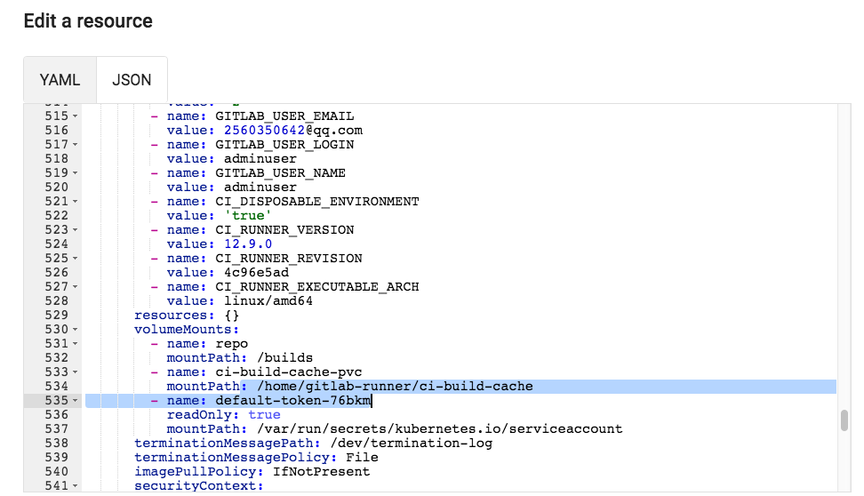

# Runner 构建环境优化配置

### runner部署优化

- 添加构建缓存PVC
- 添加工作目录PVC
- 开启自定义构建目录


#### 准备工作

runner配置信息可以通过参数指定，也可以以环境变量方式设置。详细内容可以通过 `gitlab-runner register -h `获取到相关参数和变量名称。

在使用官方提供的runner镜像注册runner，默认的runner配置文件在`/home/gitlab-runner/.gitlab-runner/config.toml`


参考文档：http://s0docs0gitlab0com.icopy.site/runner/executors/kubernetes.html#using-volumes

----


#### 解决构建缓存问题

所谓的构建缓存就是我们在进行maven/npm等构建工具打包时所依赖的包。默认会在私服中获取，加快构建速度可以在本地缓存一份。在此，我们需要创建PVC来持久化构建缓存，加速构建速度。为了节省存储空间决定不在每个项目中存储构建缓存，而是配置全局缓存。

准备本机缓存目录

```
/opt/ci-build-cache
```


首先，创建一个PVC用于挂载到pod中使用。

```
apiVersion: v1
kind: PersistentVolume
metadata:
  name: ci-build-cache-pv
  namespace: gitlab-runner
  labels:
    type: local
spec:
  storageClassName: manual
  capacity:
    storage: 10Gi
  accessModes:
    - ReadWriteOnce
  hostPath:
    path: "/opt/ci-build-cache"
---
apiVersion: v1
kind: PersistentVolumeClaim
metadata:
  name: ci-build-cache-pvc
  namespace: gitlab-runner
spec:
  storageClassName: manual
  accessModes:
    - ReadWriteOnce
  resources:
    requests:
      storage: 5Gi
```

使用命令查看验证

```
# kubectl get pvc -n gitlab-runner
NAME                 STATUS   VOLUME              CAPACITY   ACCESS MODES   STORAGECLASS   AGE
ci-build-cache-pvc   Bound    ci-build-cache-pv   10Gi       RWO            manual     5h41m

```

---


OK，pvc准备好了，考虑到不能每次部署runner都手动挂载pvc，需要自定义gitlab-runner chart，优化runner配置。

第一步：编辑value.yml文件，添加构建缓存信息配置。

```
## configure build cache
cibuild:
  cache:
    pvcName: ci-build-cache-pvc
    mountPath: /home/gitlab-runner/ci-build-cache
```

第二步：编辑templates/configmap.yml文件，entrypoint部分添加runner配置。在start之前添加，这样runner在创建构建pod的时候会根据配置挂载pvc。

```
    # add build cache
    cat >>/home/gitlab-runner/.gitlab-runner/config.toml <<EOF
      [[runners.kubernetes.volumes.pvc]]
      name = "{{.Values.cibuild.cache.pvcName}}"
      mount_path = "{{.Values.cibuild.cache.mountPath}}"
    EOF

    # Start the runner
    exec /entrypoint run --user=gitlab-runner \
      --working-directory=/home/gitlab-runner
```

到此gitlab-runner chart部分配置就完成了，接下来可以通过Helm命令进行创建和更新了。

```
helm install gitlab-runner04 ./gitlab-runner --namespace gitlab-runner
helm upgrade gitlab-runner04 ./gitlab-runner --namespace gitlab-runner
```

使用以上命令部署完成后，可以在gitlab admin页面和k8s面板查看runner的状态，确保部署成功。查看pod配置。



---

部署完成了，后续使用构建工具打包时添加指定缓存目录。例如：maven

```
mvn clean package  -DskipTests -Dmaven.repo.local=/home/gitlab-runner/ci-build-cache/maven  
```

发现构建速度很快证明已经完成构建缓存配置。可以配合查看本地缓存目录是否有更新（目录时间）。

---


#### 解决构建制品问题

在kubernetes中对cache支持一般，我们可以使用artifacts进行代替。但是考虑到artifacts收集制品会占用存储空间，所以准备研究下如何配置统一的缓存。实际上我们可以将repo目录做成持久化。

经过测试，在使用kubernetes执行器创建的构建pod会默认挂载一个空目录。此目录用于存储每次下载的代码，因为是空目录的原因导致后续测试pod无法获取需要重新下载代码，这还不要紧，重要的是构建生成的文件target目录都不存在了导致后续步骤接连失败。


由于yaml文件都是有官方默认配置的，问题不好定位。这其实是个两年前的问题了。 https://gitlab.com/gitlab-org/gitlab-runner/-/issues/3148 。最后经过分析直接将持久化的pvc挂载到空目录中的某个目录中。需要配置runner自定义构建目录，但是构建目录必须是在$CI_BUILD_DIRS目录里面。


准备本地的工作目录

```
/opt/ci-build-dir
```


创建repo持久化pvc

```
apiVersion: v1
kind: PersistentVolume
metadata:
  name: ci-build-dir-pv
  namespace: gitlab-runner
  labels:
    type: local
spec:
  storageClassName: manual
  capacity:
    storage: 10Gi
  accessModes:
    - ReadWriteOnce
  hostPath:
    path: "/opt/ci-build-dir"
---
apiVersion: v1
kind: PersistentVolumeClaim
metadata:
  name: ci-build-dir-pvc
  namespace: gitlab-runner
spec:
  storageClassName: manual
  accessModes:
    - ReadWriteOnce
  resources:
    requests:
      storage: 5Gi
```


使用命令验证

```
# kubectl get pvc -n gitlab-runner
NAME                 STATUS   VOLUME              CAPACITY   ACCESS MODES   STORAGECLASS   AGE
ci-build-cache-pvc   Bound    ci-build-cache-pv   10Gi       RWO            manual         6h41m
ci-build-dir-pvc     Bound    ci-build-dir-pv     10Gi       RWO            manual         3h11m
```

---


编译values.yaml文件添加注册配置变量。`RUNNER_BUILDS_DIR`定义构建目录。`CUSTOM_BUILD_DIR_ENABLED`开启自定义构建目录配置。

```
envVars:
  - name: RUNNER_BUILDS_DIR
    value: "/home/gitlab-runner/ci-build-dir/"
  - name: CUSTOM_BUILD_DIR_ENABLED
    value: true
```


添加repo目录缓存配置，我们把自定义的构建目录放到默认构建目录的下面builds目录中。

```
## configure build cache
cibuild:
  cache:
    pvcName: ci-build-cache-pvc
    mountPath: /home/gitlab-runner/ci-build-cache
  builds:
    pvcName: ci-build-dir-pvc
    mountPath: /home/gitlab-runner/ci-build-dir/builds
```

编辑templates/configmap.yml

```
    # add build cache
    cat >>/home/gitlab-runner/.gitlab-runner/config.toml <<EOF
      [[runners.kubernetes.volumes.pvc]]
      name = "{{.Values.cibuild.cache.pvcName}}"
      mount_path = "{{.Values.cibuild.cache.mountPath}}"
      [[runners.kubernetes.volumes.pvc]]
      name = "{{.Values.cibuild.builds.pvcName}}"
      mount_path = "{{.Values.cibuild.builds.mountPath}}"
    EOF
```


更新runner

```
helm install gitlab-runner04 ./gitlab-runner --namespace gitlab-runner
helm upgrade gitlab-runner04 ./gitlab-runner --namespace gitlab-runner
```

---

在CI文件中配置，如果不开启自定义构建目录配置会出现错误。

```
variables:
  GIT_CLONE_PATH: $CI_BUILDS_DIR/builds/$CI_PROJECT_NAMESPACE/$CI_PROJECT_NAME/$CI_PIPELINE_ID

```


---

经过测试在本地的pv中能够看到，下载的代码文件。但是默认每次每个job运行的时候都会获取远程最新的代码，会把构建目录删除掉，此时就需要配置git checkout策略了。其实按照我们目前的场景，不需要每个作业都下载代码。只要第一个作业下载好最新的代码，然后运行流水线即可。当在运行流水线的过程中遇到新代码提交可以放到下次流水线执行。 

需要在ci文件中定义`GIT_CHECKOUT`变量，默认值为true，即每次都需要代码下载。我们将全局配置为false然后在build作业中配置为true。也就实现了只在build作业下载最新代码了。

```
GIT_CHECKOUT: "false" 
```

参考链接：http://s0docs0gitlab0com.icopy.site/ee/ci/yaml/README.html#git-checkout

---


参考文档：

http://s0docs0gitlab0com.icopy.site/runner/executors/kubernetes.html#using-volumes k8srunner配置volume

https://gitlab.com/gitlab-org/gitlab-foss/-/blob/master/.gitlab-ci.yml 企业级ci模板


