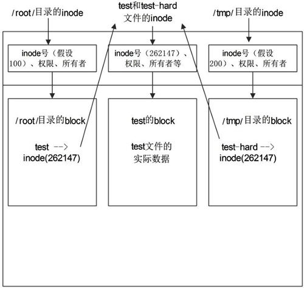

# 链接

建立硬链接和软链接非常简单，那这两种链接有什么区别? 它们都有什么作用? 这才是链接文件最不容易理解的地方，我们分别来讲讲。

## ln 创建硬链接

我们再来建立一个硬链接文件，然后看看这两个文件的特点。

```text
[root@localhost ~]# touch test
#建立源文件
[root@localhost ~]# ln /root/test /tmp/test-hard
#给源文件建立硬链接文件 /tmp/test-hard
[root@localhost ~]# ll -i /root/test /tmp/test-hard
262147 -rw-r--r-- 2 root root 0 6月 19 10:06 /root/test
hard
262147 -rw-r--r-- 2 root root 0 6月 19 10:06 /tmp/test-hard
#查看两个文件的详细信息，可以发现这两个文件的 inode 号是一样的，"ll"等同于"ls -l"。
```

这里有一件很奇怪的事情，我们之前在讲 inode 号的时候说过，每个文件的 inode 号都应该是不一样的。inode 号就相当于文件 ID，我们在查找文件的时候，要先查找 inode 号，才能读取到文件的内容。

但是这里源文件和硬链接文件的 inode 号居然是一样的，那我们在查找文件的时候，到底找到的是哪一个文件呢? 我们来画一张示意图，如图 2 所示。



在 inode 信息中，是不会记录文件名称的，而是把文件名记录在上级目录的 block 中。也就是说，目录的 block 中记录的是这个目录下所有一级子文件和子目录的文件名及 inode 的对应；而文件的 block 中记录的才是文件实际的数据。

当我们查找一个文件，比如 `/root/test` 时，要经过以下步骤:

* 首先找到根目录的 inode\(根目录的 inode 是系统已知的，inode 号是 2\)，然后判断用户是否有权限访问根目录的 block。
* 如果有权限，则可以在根目录的 block 中访问到 `/root` 的文件名及对应的 inode 号。
* 通过 `/root/` 目录的 inode 号，可以查找到 `/root/` 目录的 inode 信息，接着判断用户是否有权限访问 `/root/` 目录的 block。
* 如果有权限，则可以从 `/root/` 目录的 block 中读取到 test 文件的文件名及对应的 inode 号。
* 通过 test 文件的 inode 号，就可以找到 test 文件的 inode 信息，接着判断用户是否有权限访问 test 文件的 block。
* 如果有权限，则可以读取 block 中的数据，这样就完成了 `/root/test` 文件的读取与访问。

按照这个步骤，在给源文件 `/root/test` 建立了硬链接文件 `/tmp/test-hard` 之后，在 `/root/` 目录和 `/tmp/` 目录的 block 中就会建立 test 和 test-hard 的信息，这个信息主要就是文件名和对应的 inode 号。但是我们会发现 test 和 test-hard 的 inode 信息居然是一样的，那么，我们无论访问哪个文件，最终都会访问 inode 号是 262147 的文件信息。

这就是硬链接的原理。硬链接的特点如下:

* 不论是修改源文件\(test 文件\)，还是修改硬链接文件\(test-hard 文件\)，另一个文件中的数据都会发生改变。
* 不论是删除源文件，还是删除硬链接文件，只要还有一个文件存在，这个文件\(inode 号是 262147 的文件\)都可以被访问。
* 硬链接不会建立新的 inode 信息，也不会更改 inode 的总数。
* 硬链接不能跨文件系统\(分区\)建立，因为在不同的文件系统中，inode 号是重新计算的。
* 硬链接不能链接目录，因为如果给目录建立硬链接，那么不仅目录本身需要重新建立，目录下所有的子文件，包括子目录中的所有子文件都需要建立硬链接，这对当前的 Linux 来讲过于复杂。

硬链接的限制比较多，既不能跨文件系统，也不能链接目录，而且源文件和硬链接文件之间除 inode 号是一样的之外，没有其他明显的特征。这些特征都使得硬链接并不常用，大家有所了解就好。

## ln 创建软链接

软链接也称作符号链接，相比硬链接来讲，软链接就要常用多了。我们先建立一个软链接，再来看看软链接的特点。

```text
[root@localhost ~]# touch check
#建立源文件
[root@localhost ~]# ln -s /root/check /tmp/check-soft
#建立软链接文件
[root@localhost ~]# ll -id /root/check /tmp/check-soft
262154 -rw-r--r-- 1 root root 0 6月 19 11:30 /root/check
917507 lrwxrwxrwx 1 root root 11 6月 19 11:31 /tmp/ check-soft -> /root/check
#软链接和源文件的 inode 号不一致，软链接通过 -> 明显地标识出源文件的位置
#在软链接的权限位 lrwxrwxrwx 中，l 就代表软链接文件
```

再强调一下，软链接的源文件必须写绝对路径，否则建立的软链接文件就会报错，无法正常使用。

软链接的标志非常明显，首先，权限位中"l"表示这是一个软链接文件；其次，在文件的后面通过 "-&gt;" 显示出源文件的完整名字。所以软链接比硬链接的标志要明显得多，而且软链接也不像硬链接的限制那样多，比如软链接可以链接目录，也可以跨分区来建立软链接。

软链接完全可以当作 Windows 的快捷方式来对待，它的特点和快捷方式一样，我们更推荐大家使用软链接，而不是硬链接。

大家在学习软链接的时候会有一些疑问: Windows 的快捷方式是由于源文件放置的位置过深，不容易找到，建立一个快捷方式放在桌面，方便查找，那 Linux 的软链接的作用是什么呢?

软链接主要是为了照顾管理员的使用习惯。比如，有些系统的自启动文件 `/etc/rc.local` 放置在 `/etc` 目录中，而有些系统却将其放置在 `/etc/rc.d/rc.local` 中，那么干脆对这两个文件建立软链接，不论您习惯操作哪一个文件，结果都是一样的。

如果您比较细心，则应该已经发现软链接和源文件的 inode 号是不一致的，我们也画一张示意图来看看软链接的原理，如图 3 所示。


软链接和硬链接在原理上最主要的不同在于: 硬链接不会建立自己的 inode 索引和 block\(数据块\)，而是直接指向源文件的 inode 信息和 block，所以硬链接和源文件的 inode 号是一致的；而软链接会真正建立自己的 inode 索引和 block，所以软链接和源文件的 inode 号是不一致的，而且在软链接的 block 中，写的不是真正的数据，而仅仅是源文件的文件名及 inode 号。

我们来看看访问软链接的步骤和访问硬链接的步骤有什么不同。

* 首先找到根目录的 inode 索引信息，然后判断用户是否有权限访问根目录的 block。
* 如果有权限访问根目录的 block，就会在 block 中查找到 `/tmp/` 目录的 inode 号。
* 接着访问 `/tmp/` 目录的 inode 信息，判断用户是否有权限访问 `/tmp/` 目录的 block。
* 如果有权限，就会在 block 中读取到软链接文件 check-soft 的 inode 号。因为软链接文件会真正建立自己的 inode 索引和 block，所以软链接文件和源文件的 inode 号是不一样的。
* 通过软链接文件的 inode 号，找到了 check-soft 文件 inode 信息，判断用户是否有权限访问 block。
* 如果有权限，就会发现 check-soft 文件的 block 中没有实际数据，仅有源文件 check 的 inode 号。
* 接着通过源文件的 inode 号，访问到源文件 check 的 inode 信息，判断用户是否有权限访问 block。
* 如果有权限，就会在 check 文件的 block 中读取到真正的数据，从而完成数据访问。

通过这个过程，我们就可以总结出软链接的特点\(软链接的特点和 Windows 中的快捷方式完全一致\)。

* 不论是修改源文件\(check\)，还是修改硬链接文件\(check-soft\)，另一个文件中的数据都会发生改变。
* 删除软链接文件，源文件不受影响。而删除原文件，软链接文件将找不到实际的数据，从而显示文件不存在。
* 软链接会新建自己的 inode 信息和 block，只是在 block 中不存储实际文件数据，而存储的是源文件的文件名及 inode 号。
* 软链接可以链接目录。
* 软链接可以跨分区。

